# Architecture & Design Decisions

**MX-5 NC1 Wheel Alignment System**  
Last updated: April 26, 2026

---

## System Overview

The alignment system is a **web-based analysis tool** that helps home mechanics optimize wheel alignment by:
1. **Capturing measurements** from physical testing (camber, caster, toe at various bolt positions)
2. **Analyzing trade-offs** using a weighted scoring algorithm
3. **Recommending optimal bolt positions** that balance multiple objectives
4. **Visualizing results** through tables, charts, and eccentric bolt diagrams

**Key constraint**: The system works with **discrete bolt positions** (13×13 grid per wheel). It does **not** calculate continuous adjustments.

---

## 13×13 Grid Structure (Front × Rear Bolt Combinations)

The alignment measurement grid represents **all combinations of two eccentric bolts**:

```
          REAR BOLT POSITIONS (columns)
          ← −6  −5  −4  −3  −2  −1   0  +1  +2  +3  +4  +5  +6 →
    
    −6  [ ]  [ ]  [ ]  [ ]  [ ]  [ ]  [ ]  [ ]  [ ]  [ ]  [ ]  [ ]  [ ]
    −5  [ ]  [ ]  [ ]  [ ]  [ ]  [ ]  [ ]  [ ]  [ ]  [ ]  [ ]  [ ]  [ ]
    −4  [ ]  [ ]  [ ]  [ ]  [ ]  [ ]  [ ]  [ ]  [ ]  [ ]  [ ]  [ ]  [ ]
    ↑   [ ]  [ ]  [ ]  [ ]  [ ]  [ ]  [ ]  [ ]  [ ]  [ ]  [ ]  [ ]  [ ]
    |   [ ]  [ ]  [ ]  [ ]  [ ]  [ ]  [ ]  [ ]  [ ]  [ ]  [ ]  [ ]  [ ]
 F  |   [ ]  [ ]  [ ]  [ ]  [ ]  [ ]  [ ]  [ ]  [ ]  [ ]  [ ]  [ ]  [ ]
 R  0   [ ]  [ ]  [ ]  [ ]  [ ]  [ ]  [ ]  [*]  [ ]  [ ]  [ ]  [ ]  [ ]  ← bestCell (Front 0, Rear 0)
 O  |   [ ]  [ ]  [ ]  [ ]  [ ]  [ ]  [ ]  [ ]  [ ]  [ ]  [ ]  [ ]  [ ]
 N  |   [ ]  [ ]  [ ]  [ ]  [ ]  [ ]  [ ]  [ ]  [ ]  [ ]  [ ]  [ ]  [ ]
 T  ↓   [ ]  [ ]  [ ]  [ ]  [ ]  [ ]  [ ]  [ ]  [ ]  [ ]  [ ]  [ ]  [ ]
    +6  [ ]  [ ]  [ ]  [ ]  [ ]  [ ]  [ ]  [ ]  [ ]  [ ]  [ ]  [ ]  [ ]

B O L T   P O S I T I O N S   ( r o w s )
```

**Key Points**:
- Each cell = one complete configuration (Front bolt position + Rear bolt position)
- 13 positions per axis × 13 = **169 total configurations per wheel**
- When comparing wheels, we compare **entire cells** (configurations), never individual bolt positions
- Each configuration produces two outputs: camber and caster values
- The three optima (bestCell, bestCamber, bestCaster) are three different cells from this grid

**Example**: Cell (Front +1, Rear −2) means: "Adjust front bolt to +1, rear bolt to −2 → produces camber −1.10°, caster 4.99°"

---


```
┌─ INPUT PAGE ─────────────────────────────────┐
│                                               │
│  User enters measurements in grid:           │
│  • Camber readings (−20° sweep, 0°, +20°)   │
│  • At multiple bolt positions (13×13)        │
│                                               │
│  Wheel selection: FL or FR (front only)      │
│  Auto-save to browser localStorage           │
└──────────────────────┬──────────────────────┘
                       │ (localStorage: gridState)
                       ↓
        ┌──────────────────────────────┐
        │  BROWSER localStorage        │
        │  └─ wheel-FL-gridState       │
        │  └─ wheel-FR-gridState       │
        │  └─ alignment-settings       │
        └──────────────────────────────┘
                       │
                       ↓
┌─ REPORT PAGE ────────────────────────────────┐
│                                               │
│  1. Load gridState from localStorage         │
│     └─ Convert to format for calculations    │
│                                               │
│  2. PROCESS WHEEL (report-engine.js)         │
│     └─ Input: 13×13 grid of camber readings │
│     └─ Output: {                             │
│          bestCell, bestCamberCell,           │
│          bestCasterCell,                     │
│          grid, rows, analysis                │
│        }                                      │
│                                               │
│  3. SYMMETRY ANALYSIS (report-engine.js)     │
│     └─ Compare FL vs FR results              │
│     └─ Find symmetric value pairs            │
│     └─ Generate recommendation               │
│     Output: {                                │
│          flRecommendation,  frRecommendation │
│        }                                      │
│                                               │
│  3. RENDER TO UI (report-page.js)            │
│     ├─ Raw Data Table (13×13, color-coded)  │
│     ├─ Camber/Caster Chart (line graph)     │
│     ├─ Washer Diagrams (bolt positions)     │
│     ├─ Symmetry Analysis (L/R comparison)   │
│     └─ Trade-Off Analysis (secondary info)  │
│                                               │
└──────────────────────────────────────────────┘
```

---

## Input Screen Architecture

### Design Principles

The input screen serves a single purpose: **Capture wheel alignment measurements in a 13×13 discrete grid format**.

**Key Constraints**:
1. **Three steering angles only**: Measure camber at +20°, 0°, and −20° steering angles
2. **Position range**: 5–13 measurements per bolt (at least 5, up to all 13 positions from −6 to +6)
3. **LocalStorage as source of truth**: All measurements immediately persisted; no file-based state
4. **Auto-save on every edit**: User never has to manually save
5. **Wheel isolation**: FL and FR sections are independent; no cross-wheel validation
6. **Clear = both UI and localStorage**: Pressing Clear removes all data everywhere

### Data Flow

```
User Input (HTML form)
    ↓ (on each cell edit)
    ├─→ Update UI grid display
    ├─→ Validate input (numeric, range check)
    └─→ Save immediately to localStorage: 
        {
          wheel: 'FL',
          measurements: {
            pos_minus6_minus6: { camber: -1.25, ... },
            ...
          }
        }

User Loads Sample Data
    ↓
    └─→ localStorage cleared
    └─→ New sample gridState loaded to localStorage
    └─→ UI refreshed from localStorage

User Imports CSV
    ↓
    └─→ Parse CSV file
    └─→ Convert to gridState format
    └─→ Write to localStorage (becomes truth)
    └─→ UI refreshes from localStorage

User Presses Clear
    ↓
    ├─→ Clear all form fields (UI)
    ├─→ Remove all localStorage keys:
    │   - localStorage.removeItem('wheel-FL-gridState')
    │   - localStorage.removeItem('wheel-FR-gridState')
    │   - localStorage.removeItem('targets')
    └─→ Blank slate
```

### CSV Import/Export Rules

**Import Rules** (see [DESIGN.md § CSV as Import/Export Only](DESIGN.md)):
- CSV is read into memory
- Parsed and converted to gridState format
- Immediately written to localStorage
- CSV file is **not** kept as reference or state
- Users can delete the CSV safely; data is now in browser localStorage

**Export Rules**:
- Read current gridState from localStorage
- Format as CSV (header row + data rows)
- Trigger browser download (optional user save)
- Continue working with browser localStorage
- Exported CSV is a **snapshot only**, not linked to current session

### Sample Data Strategy

Two realistic 13×13 grids (FL and FR) with intentionally different patterns demonstrate that wheels often require different bolt positions. Loaded via `input.html` buttons, they showcase how value symmetry (matching alignment values) differs from bolt symmetry (matching positions).

---

## Report Page Architecture

### Design Principles

The report page transforms raw measurements into recommendations through a **multi-section pipeline**:

```
1. Raw Data         →  See your measurements (heatmap, color coded)
2. Camber/Caster    →  See trends (line charts)
3. Diagrams         →  See bolt positions (visual feedback)
4. Symmetry         →  See recommendations (L/R comparison)
5. Analysis         →  See trade-offs (optional detail)
```

**Key Constraint**: Single page, no section hiding; users scroll or use buttons to switch focus areas.

### Section Navigation Structure

**Left/Right Switching**:
- Buttons to toggle between FL, FR display
- Each section shows either FL or FR, never both simultaneously
- Example: "Symmetry Panel" shows either "FL vs FR comparison" or detailed FL-only view

**Front/Rear Placeholder** (for Phase 2):
- Currently: Only FL/FR available (front wheels)
- Future: Will add RL/RR buttons when four-wheel support added
- Current Phase 1: Front/Rear buttons not visible

**Camber/Caster Highlighting** (within same section):
- Buttons toggle which measurement is highlighted
- Raw Data Table: Both camber and caster visible; buttons change cell color emphasis
- Charts: Both curves drawn; buttons emphasize one line over the other
- Washer Diagrams: Shows position of ONE bolt per button (front or rear)

**Rule**: Switching buttons does NOT change the displayed data, only which aspect is emphasized

### Spatial Layout Rules

**Left/Right Positioning**:
- Left wheel (FL) always displays on left side of screen
- Right wheel (FR) always displays on right side of screen
- If section is split horizontally, left data on left, right data on right

**Front/Rear Positioning** (preparation for Phase 2):
- Front measurements display at TOP of section
- Rear measurements display at BOTTOM of section
- This applies to all section types: tables, charts, diagrams

**Example Layout**:
```
┌─────────────────────────────────────────────┐
│         Symmetry Analysis Section           │
├─────────────────────┬──────────────────────┤
│                     │                       │
│  Camber Caster      │  Camber Caster       │  ← Front row (unused in Phase 1)
│  value  value       │  value  value        │
│                     │                       │
│  FL                 │  FR                  │  ← Labels: Left and Right
│  Front 0            │  Front +1            │
│  Rear -2            │  Rear -1             │
│                     │                       │
├─────────────────────┴──────────────────────┤
│         Recommendation: SYMMETRIC           │
└─────────────────────────────────────────────┘
```

### Button Behavior Rules

**All buttons are in the same container**:
- "Switch to FL" and "Switch to FR" buttons visible simultaneously
- Only one is active (highlighted/pressed state) at a time
- Clicking loads new section content below

**Camber/Caster buttons**:
- Both visible simultaneously
- Only one "active" at a time
- Clicking toggles the emphasis (color, line thickness, etc.)
- **Critical**: Data does NOT change, only display emphasis

```
Example: True Camber/Caster Toggle Behavior
────────────────────────────────────────────
Raw Data Table (13×13 grid):

Before toggle:
┌──────────────┬──────────────┐
│ Camber (emph)│ Caster       │  ← Green/Orange/Red indicates camber quality
│ Cell colors  │ (unfocused)  │
└──────────────┴──────────────┘

After clicking Caster button:
┌──────────────┬──────────────┐
│ Camber       │ Caster (emph)│  ← Green/Orange/Red now indicates caster quality
│ (unfocused)  │ Cell colors  │
└──────────────┴──────────────┘

But the actual values shown remain identical; only visual emphasis changes
```

---

## Module Responsibilities

### **Data Layer** (Persistence & Format)

| Module | Responsibility |
|--------|---|
| `constants.js` | Configuration: targets, thresholds, bolt positions, physical constants |
| `localstorage-io.js` | Read/write localStorage; serialize/deserialize gridState |
| `csv-io.js` | CSV import/export; file I/O operations |

### **Processing Layer** (Analysis & Calculations)

| Module | Responsibility |
|--------|---|
| `report-engine.js` | Core analysis: scoring, grid interpolation, symmetry analysis |
| `interpolation.js` | Fill gaps in measurement grid using polynomial interpolation |
| `targets-manager.js` | Calculate target values and acceptable error ranges |

### **Presentation Layer** (UI & Rendering)

| Module | Responsibility |
|--------|---|
| `input-grid.js` | Input sheet: grid rendering, cell editing, auto-save |
| `report-page.js` | Report: load data, orchestrate rendering, handle events |
| `chart-builder.js` | Chart.js wrapper: generate camber/caster line charts |
| `washer-diagram.js` | SVG rendering: eccentric bolt position diagrams |

### **Utilities**

| Module | Responsibility |
|--------|---|
| `server.js` | Development web server (Node.js) |
| `generate-dummy-data.mjs` | Generate sample alignment data for testing |

---

## Related Documentation

**For detailed module reference**, see:
- [INDEX.md](INDEX.md) — Quick lookup for all 21 modules with methods, dependencies, usage patterns
- [MODULES.md](MODULES.md) — Full module documentation organized by layer

**For design rationale**, see:
- [DESIGN.md](DESIGN.md) — 8 key decisions and 6 implementation constraints
- [QUICKSTART.md](QUICKSTART.md) — Integration scenarios and quick reference

---

## Key Algorithms

### ⚠️ Important: Algorithm Not Meant to Be Edited

The symmetry analysis algorithm is **designed to be stable and not modified**. It uses a simple, straightforward approach:

1. **Search all possible pairs** (169 FL configurations × 169 FR configurations = 28,561 comparisons)
2. **Find closest match** where camber and caster differ by ≤±0.3° on both wheels
3. **Return best compromise** (the pair with lowest combined error)

**Why this design**:
- Transparent and auditable (easy to verify results)
- No complex weighting or tuning required
- Users understand exactly why a position was recommended
- Simple logic = fewer bugs = more maintainable

**Do NOT modify because**:
- Weighting factors would add confusion (users wouldn't understand "why" recommendations changed)
- The ±0.3° tolerance is the key parameter; change that, not algorithm weights
- More complex algorithms are harder to debug when users report surprising results

If you disagree with a recommendation, **adjust the ±0.3° tolerance**, not the algorithm itself.

---

### **Algorithm 1: Process Wheel → Find Best Position per Wheel**

**Input**: 13×13 grid of camber readings at different bolt positions

**Steps**:
1. Interpolate grid to fill any gaps
2. For each grid position, calculate how far it is from target:
   - Camber error: |reading − TARGET_CAMBER|
   - Caster error: |reading − TARGET_CASTER|
3. Find the position with the best combination of errors:
   - Prioritize getting camber right (tire wear matters most)
   - Then get caster as close as possible
   - No weighting formula; just the closest match

**Output**: `{ bestPosition, camber, caster, camberError, casterError }`

**See**: [report-engine.js `processWheel()`](../js/report-engine.js)

### **Algorithm 2: Symmetry Analysis → Compare Complete Configurations L/R**

**Input**: FL and FR processed results (each with best position, camber, caster values)

**Key Principle**: 
- Each position in the 13×13 grid represents a complete configuration: **Front bolt position + Rear bolt position**
- We compare FL's complete configurations vs FR's complete configurations
- We do NOT compare front bolts independently or rear bolts independently
- See [DESIGN.md § Eccentric Bolt Coupling](DESIGN.md) for physical rationale

**Steps**:
1. Search for **symmetric pairs** with ±0.3° tolerance:
   - Try all combinations of FL configurations (169) × FR configurations (169)
   - For each pair, check: |FL camber − FR camber| ≤ 0.3° AND |FL caster − FR caster| ≤ 0.3°?
   - Calculate combined error: (|camberDelta| + |casterDelta|) / 2
   - Find the pair with lowest error

2. Return the best available pair:
   - If a perfect match exists within tolerance: return it (true symmetry)
   - If no perfect match: return the closest approximation (best compromise)

**Output**: `{ flRecommendation, frRecommendation, matchType }`
- `flRecommendation`: Front position, Rear position, resulting camber, resulting caster for FL wheel
- `frRecommendation`: Same for FR wheel
- `matchType`: "symmetric" if values match within ±0.3°, or "asymmetric" if this is the best compromise

**See**: [report-engine.js `symmetryAnalysis()`](../js/report-engine.js)

**Why This Matters**:
The grid search (13×13 = 169 positions per wheel) explores all possible combinations of front/rear bolts. Each cell represents one complete configuration. The search naturally respects the physical coupling of the two eccentric bolts and ensures both are optimized together, not matched independently.

### **Algorithm 3: Interpolation → Fill Grid Gaps**

**Problem**: Not all 169 positions measured; grid has sparse data

**Solution**: Polynomial interpolation across rows/columns

**See**: [interpolation.js](../js/interpolation.js)

---

## Algorithm 4: Raw Data Table Rendering (Section 2.1)

### Purpose & Use Case

**The Raw Data Summary Table** displays all 169 bolt position combinations (13×13 grid) with their calculated camber and caster values. It serves as:
- **Ground truth display**: Shows the exact measurements/calculations for every bolt combination
- **Visual pattern recognition**: Users can spot trends (which positions work best for each metric)
- **Target matching highlight**: Top 3-5 closest matches to targets highlighted in blue (camber) or green (caster) for quick scanning
- **Data validation**: Allows users to verify interpolated vs measured cells

### Data Flow

```
Input: ProcessedWheel object
  └─ grid[13][13] array of measurements
  └─ bestCell, bestCamberCell, bestCasterCell (for color coding)

Processing: _getTopTargetMatches(grid)
  └─ Find top 3-5 closest matches for camber target
  └─ Find top 3-5 closest matches for caster target
  └─ Return Map of position → matchType ('camber', 'caster', 'both')

Rendering: _buildTable(result)
  └─ Create 13×13 HTML table
  └─ Headers: Rear bolt positions (−6 to +6, columns)
  └─ Row labels: Front bolt positions (−6 to +6, rows)
  └─ Each cell contains:
     • Camber value (top)
     • Caster value (bottom)
     • Color coding based on selected metric (camber or caster)
     • Special formatting for interpolated or required cells

Output: HTML <table> element appended to DOM
```

### Implementation Details

**File**: [js/report-page.js](../js/report-page.js) lines 380–670

**Key Functions**:

```javascript
_getTopTargetMatches(grid)  // Identify 3-5 closest matches per metric
_buildTable(result)          // Create 13×13 table with color coding
_valueClass(camber, caster) // Determine color tier (green/orange/red)
```

**Color Coding Tiers** (via CSS classes):
- **Green (target-met)**: Within tolerance of target
  - Camber: ≤±0.15° from −1.1°
  - Caster: ≤±0.25° from 5.0°
- **Orange (near-target)**: Within relaxed tolerance
  - Camber: ≤±0.40° from −1.1°
  - Caster: ≤±0.60° from 5.0°
- **Red (off-target)**: Exceeds acceptable range

**Cell Markup**:

```html
<!-- Basic cell structure -->
<td class="[interpolated] [required-col] [best-camber|best-caster|best-both]">
  <div class="cell-value">
    <div class="camber [target-met|near-target|off-target|muted]">
      -1.10°
    </div>
    <div class="caster [target-met|near-target|off-target|muted]">
      5.05°
    </div>
  </div>
</td>
```

### Features & Limitations

**Features**:
✅ Dual-value display (camber + caster in one cell)
✅ Focused indicators: Only top ~10-15 cells highlighted per metric (not all 169)
✅ Visual distinction for interpolated cells (italic styling)
✅ Special border on required measurement positions
✅ Toggle between "Color by Camber" and "Color by Caster" without page reload
✅ Responsive scrolling for 13×13 grid

**Limitations**:
❌ **Freezing**: Table headers don't freeze when scrolling (minor UX issue)
❌ **Single wheel only**: Shows one wheel (FL or FR) at a time; no side-by-side comparison in Phase 1
❌ **No cell highlighting on hover**: Clicking a cell doesn't highlight the corresponding position on washer diagrams (potential future enhancement)
❌ **Large file size**: Full 169-cell table can be slow on low-end devices
❌ **Print-friendly**: Not optimized for printing (colors may not render, table may break across pages)
❌ **Accessibility**: Limited ARIA labels; color-only differentiation in some cells

**Known Issues**:
- Table may overflow horizontally on small screens (mobile not optimized in Phase 1)
- Color-coded cells only meaningful when color vision available (could add patterns or text labels)

---

## Algorithm 5: Camber & Caster Chart Rendering (Section 2.2)

### Purpose & Use Case

**The Combination Chart** plots camber and caster as continuous functions of front bolt position, allowing users to:
- **Visualize trade-offs**: See how camber and caster vary as you adjust the front bolt (rear bolt = 0 nominal)
- **Understand coupling**: Observe that adjusting front bolt affects both camber and caster
- **Find crossings**: Identify where lines intersect target values (marked with vertical dashed lines)
- **Compare wheels**: Toggle between FL and FR to see if one wheel has better trade-off potential

### Data Flow

```
Input: ProcessedWheel.rows169 array (full 169-point dataset)
  └─ Each row: { frontBolt, rearBolt, camber, caster, camberDelta, casterDelta }

Aggregation: _aggregateByFrontBolt(rows169)
  └─ Group rows by front bolt position
  └─ For each front bolt −6 to +6:
     • Extract row where rear bolt = 0 (nominal configuration)
     • If unavailable, find best available row for that front bolt
  └─ Result: 13-point aggregated dataset (one per front bolt)

Chart Creation: buildMainChart(canvasId, rows169, wheel)
  └─ Using aggregated data (13 points)
  └─ Generate 4 line datasets:
     1. Camber values (blue line, left Y-axis)
     2. Caster values (green line, right Y-axis)
     3. Camber target (blue dashed line)
     4. Caster target (green dashed line)

Plugin: dropLinesPlugin
  └─ Detect where camber line crosses target (±0.15°)
  └─ Detect where caster line crosses target (±0.25°)
  └─ Draw vertical dashed lines from crossing to X-axis
  └─ Helps users visually identify best front bolt positions

Output: Chart.js instance rendering on canvas
```

**See**: [js/chart-builder.js](../js/chart-builder.js) lines 1–550

### Implementation Details

**Key Aggregation Strategy**:

```javascript
// Extract 13-point curve from 169 measurements
// NOMINAL ASSUMPTION: rear bolt = 0 gives representative cross-section
Aggregated: [
  { frontBolt: -6, camber: -2.37, caster: 6.98 },
  { frontBolt: -5, camber: -2.05, caster: 6.52 },
  // ...
  { frontBolt:  0, camber: -1.10, caster: 5.00 },  ← Target shown here
  // ...
  { frontBolt:  6, camber:  0.45, caster: 3.05 }
]
```

**Why Aggregation Matters**:
- **Problem**: Full 169 points would create a messy, jagged line because different front bolts have different rear bolt combinations measured
- **Solution**: Normalize to rear=0 for each front bolt position, creating smooth curves
- **Trade-off**: Loss of visibility into rear bolt effect, but users can read the table for detailed exploration
- **Assumption**: Rear bolt = 0 is representative of how that front bolt position behaves

**Drop Lines Plugin** (custom Chart.js plugin):

```javascript
// Finds nearest crossing to target values
_findNearestCrossing(values, target)
  └─ Scan through data points
  └─ Find where line crosses target (or comes closest)
  └─ Linear interpolation between adjacent points
  └─ Draw vertical line at crossing position

// Result: Visual "X marks the spot" where targets are achievable
```

### Features & Limitations

**Features**:
✅ Dual Y-axes: Camber (left, blue) and Caster (right, green) at different scales
✅ Target lines: Dashed horizontal lines showing goal values
✅ Drop lines: Vertical lines at crossing points for quick visual reference
✅ Dual-axis interaction: Hover on one line shows tooltip for both metrics
✅ Wheel switching: FL/FR tabs switch data without page reload
✅ Responsive: Chart resizes with window
✅ Grid background: Subtle grid aids reading values

**Limitations**:
❌ **Aggregation artifacts**: Shows only rear bolt = 0 curve, obscures rear bolt effect
❌ **13-point resolution**: Only shows 13 front bolt positions; interpolation between missing
❌ **No points/markers**: Lines have no visible points; harder to see exact data positions
❌ **Legend not scrollable**: If many lines, legend can cover chart area
❌ **Tooltip can be clipped**: Tooltip may go off-screen near chart edges
❌ **Print-friendly**: ChartJS charts may not print well with default settings
❌ **No data export**: Can't download CSV of chart data
❌ **No zoom/pan**: Users can't zoom in on interesting regions (would require Chart.js plugin)

**Known Issues**:
- Drop lines may not render if target values are far outside data range (edge case)
- Chart flickers when switching between FL/FR (could cache previous chart values)
- No loading indicator while data is being prepared
- Small performance hit with many datasets; Chart.js renders all even if not visible

### Derivation of Caster Values

**Formula** (from 20° steering sweep):
```
Caster ≈ 1.462 × |C_+20° − C_−20°|
```

Where:
- `C_+20°` = camber reading at +20° steering
- `C_−20°` = camber reading at −20° steering
- Result is stored in grid as `caster` (calculated on load)

**In Raw Table**: Caster shown per cell is calculated from steering angle measurements
**In Chart**: Caster plotted for each front bolt position (using nominal rear bolt = 0)

---

## Color Coding System (Dual-Mode Highlighting)

### Mode 1: Color by Camber (Default)

**CSS Classes Applied**:
```css
.target-met   → GREEN   (≤±0.15° from target)
.near-target  → ORANGE  (≤±0.40° from target)
.off-target   → RED     (>±0.40° from target)
.muted        → GRAY    (not emphasized, when caster mode is on)
```

**How It Works**:
1. Calculate `|camber − TARGET_CAMBER|`
2. Assign color based on threshold
3. When "Color by Caster" is NOT selected, all cells get one of these classes
4. When "Color by Caster" IS selected, camber divs get `.muted` class (grayed out)

### Mode 2: Color by Caster

**CSS Classes Applied**:
```css
.target-met   → GREEN   (≤±0.25° from target)
.near-target  → ORANGE  (≤±0.60° from target)
.off-target   → RED     (>±0.60° from target)
.muted        → GRAY    (caster values appear muted at ≠ metrics)
```

**How It Works**:
1. Calculate `|caster − TARGET_CASTER|`
2. Assign color based on different thresholds than camber
3. When selected, applies same color logic but using caster thresholds
4. Camber divs get `.muted` class (less emphasis)

### Focused Indicators (Target Matches)

In addition to color coding, cells with top matches are highlighted:

```css
.best-camber   → BLUE BOX   (Top 3–5 closest matches to camber target)
.best-caster   → GREEN BOX  (Top 3–5 closest matches to caster target)
.best-both     → GRADIENT   (Cell meets BOTH camber AND caster closely)
.interpolated  → ITALIC     (Value was interpolated, not measured)
.required-col  → THICK BORDER (Part of minimum required 25-position set)
```

**Why Limited Highlights?**
- If all ~169 cells highlighted, table becomes a sea of color
- Only showing top 3–5 per metric allows focus on best options
- Users can still see all colors in "by camber" or "by caster" mode

---

## Table-to-Chart Relationship

**The two complementary views serve different purposes**:

| Aspect | Table | Chart |
|--------|-------|-------|
| **View** | 13×13 discrete grid | 13-point aggregated curve |
| **Data** | All 169 measured/interpolated cell values | Nominal curve (rear bolt = 0 only) |
| **Use Case** | Spot exact values; identify required positions | Understand trends; find trade-off patterns |
| **Interaction** | Click cells; read precise camber/caster | Hover tooltips; read at front bolt |
| **Color coding** | Shows proximity to targets per metric | N/A (chart doesn't color-code) |
| **Navigation** | Scroll horizontally; fixed view | Pan/zoom via responsive sizing |

---

## Performance Considerations

### Table Rendering

**DOM Nodes Created**:
- 1 table + 1 thead + 13 tbody rows + (13+1) cells per row = ~195 DOM nodes
- Each cell contains 3–5 nested divs = ~1,000 DOM nodes total
- Modern browsers handle this easily; no virtualization needed

**Reflow/Repaint**:
- Triggered on wheel switch or color-coding toggle
- Entire table rebuilt (not incremental update)
- Typically 16–50ms on modern hardware

### Chart Rendering

**Chart.js Performance**:
- 4 line datasets × 13 points = 52 data points plotted
- Dual Y-axis scales computed once per render
- Legend rendered once
- Drop lines plugin runs once per render

**Typical Performance**:
- Initial render: 50–100ms
- Wheel switch: 30–80ms (destroy old chart + build new)
- Interaction (hover/tooltip): <16ms

### Memory Usage

**Per Wheel**:
- 169 measurement cells × 40 bytes per cell ≈ 6.8 KB (grid data)
- 2 processed outputs (processed wheel + symmetry result) ≈ 5 KB
- Chart.js instance ≈ 100–150 KB (includes libraries)
- **Total per wheel**: ~170 KB (acceptable for modern browsers)

### Optimization Opportunities (Future)

- Virtualization: Only render visible table cells (would help with mobile)
- Lazy aggregation: Calculate chart aggregation only when chart becomes visible
- Worker threads: Move heavy calculations (interpolation, 169-point loop) to web worker
- Canvas rendering: Consider Canvas-based table for huge datasets (not needed for 13×13)

---

## Data Structures

### GridState (localStorage Format)

```javascript
// Stored as: localStorage.getItem('wheel-FL-gridState')
{
  wheel: 'FL',
  measurements: {
    pos_minus6_minus6: { camber: -1.25, casterPlus20: -2.0, casterMinus20: 5.2 },
    pos_minus6_minus3: { camber: -1.15, ... },
    // ... 169 positions total
  },
  timestamp: 1234567890,
  version: 2
}
```

### ProcessedWheel (After Analysis)

```javascript
{
  wheel: 'FL',
  grid: [ /* 13x13 array of measurements */ ],
  rows: [ /* 169 calculated results */ ],
  bestCell: { frontPos: 0, rearPos: -2, camber: -1.10, caster: 5.05, score: 1.5 },
  bestCamberCell: { frontPos: -1, rearPos: -3, camber: -1.10, caster: 5.19 },
  bestCasterCell: { frontPos: 1, rearPos: -1, camber: -1.12, caster: 5.00 },
}
```

### SymmetryResult (After L/R Analysis)

```javascript
{
  flRecommendation: { 
    frontPos: 0, 
    rearPos: -2, 
    camber: -1.10, 
    caster: 5.05, 
    rationale: 'Best compromise' 
  },
  frRecommendation: { 
    frontPos: 0, 
    rearPos: -2, 
    camber: -1.10, 
    caster: 5.05, 
    rationale: 'Best compromise' 
  },
  matchType: 'perfect-symmetric',  // or 'camber-symmetric', 'caster-symmetric', 'independent'
  note: 'Both wheels use identical positions and achieve symmetric values'
}
```

---

## Error Handling & Validation

### Input Validation
- Grid must be 13×13
- Measurements must be numeric
- Camber readings should be within reasonable range (roughly −3° to +1°)
- Steering angles for caster sweep should be approximately ±20°

### Graceful Degradation
- Missing measurements: Interpolation fills gaps; if grid too sparse, falls back to nearest neighbor
- No symmetric pair found: Uses independent optima with explicit note
- Invalid bolt positions: Uses closest valid position with warning

---

## Testing Strategy

### Unit Tests
- Scoring algorithm: Verify Golden Rule produces expected weights
- Interpolation: Test with known gaps and verify polynomial fit
- Data format conversions: localStorage ↔ gridState ↔ processedWheel

### Integration Tests (Puppeteer)
- End-to-end: Input → Calculate → Display
- Symmetry matching: Verify L/R pairs detected correctly
- Chart rendering: Camber/caster lines plot at correct coordinates
- Color-coding: Cells classified as GREEN/ORANGE/RED correctly

### Manual Verification
- Visual inspection: Bolt diagrams render correctly
- Readability: No text overlaps; formatting clear
- Consistency: Same data entered, same results across page reloads

---

## Performance Considerations

- **Grid processing**: 169 positions × interpolation + scoring → ~50–100 ms (acceptable for UI responsiveness)
- **Symmetry search**: 13×13 × 13×13 combinations (worst-case ~43k comparisons) → ~200 ms
- **Chart rendering**: Chart.js handles 3 lines + target markers → ~100 ms
- **Washer diagrams**: SVG rendering per wheel → ~30 ms

**Total**: Full analysis + render ~300–400 ms (imperceptible to user)

---

## Known Limitations & Future Expansion

### Phase 1 (Current: Front Wheels Only)
- Two wheels (FL, FR) analyzed
- Camber + Caster only (Toe integration outstanding)
- Front-only eccentric bolt adjustment

### Phase 2 (Planned: Four Wheels)
- Add RL, RR wheels
- Modify data structure to support 4 wheels
- Consider front-rear thrust angle alignment
- Rear wheels may have different adjustment mechanisms
- Scoring may need rear-specific targets

### Phase 3 (Future Ideas, Not Committed)
- Compare multiple preset strategy sets
- Export configuration to 3D visualization
- Mobile app with camera-based measurements
- Integration with alignment shop tools

---

## Import/Export Patterns

All modules use **ES6 modules** with consistent patterns:

```javascript
// Export
export function myFunction() { ... }
export const MY_CONSTANT = 42;

// Import
import { myFunction, MY_CONSTANT } from './other-module.js';
```

**Why ES6?**
- Native browser support in modern Node.js
- Used consistently across codebase
- Avoids CommonJS/ESM mismatch issues

---

## Dependency Map

```
report-page.js (orchestrator)
  ├─ report-engine.js (analysis)
  │   ├─ constants.js (targets, thresholds)
  │   ├─ interpolation.js (fill grid gaps)
  │   └─ targets-manager.js (calculate ranges)
  ├─ localstorage-io.js (data load)
  ├─ chart-builder.js (visualization)
  ├─ washer-diagram.js (bolt diagrams)
  
input-grid.js (orchestrator for input page)
  ├─ localstorage-io.js (save on change)
  ├─ constants.js (targets for display)
  
csv-io.js (standalone utility)
  └─ constants.js (schema definition)
```

**Principle**: Modules depend on constants, utilities; don't create circular dependencies.

---

## Security Considerations

- **No backend**: All processing client-side (JavaScript in browser)
- **No network requests**: Data never leaves user's machine
- **localStorage scope**: Per-origin, per-browser (secure by default)
- **CSV export**: User has full control over when/where to save files

**Implication**: System is fundamentally offline-first; no authentication or authorization needed.

---

## Module Reference

### Core Analysis Functions

**`report-engine.js`**

| Function | Purpose | Key Parameters |
|----------|---------|---|
| `processWheel(gridData, targetCamber, targetCaster)` | Analyze single wheel; return 3 optimal configurations | gridData (13×13), targets (degrees) |
| `symmetryAnalysis(flResult, frResult)` | Compare FL/FR results; find symmetric value pairs | Results from processWheel() |
| `interpolateGrid(grid, rows, cols)` | Fill sparse grid gaps using polynomial interpolation | gridData, position arrays |

**Example Usage**:
```javascript
import { processWheel, symmetryAnalysis } from './report-engine.js';

const flResult = processWheel(flGrid, -1.1, 5.0);
const frResult = processWheel(frGrid, -1.1, 5.0);
const symmetry = symmetryAnalysis(flResult, frResult);
// Output: { flRecommendation, frRecommendation }
```

### Data Persistence

**`localstorage-io.js`**

| Function | Purpose | Returns |
|----------|---------|---------|
| `save(wheel, gridState)` | Write grid data to localStorage | void |
| `load(wheel)` | Read grid data from localStorage | GridState or null |
| `saveTargets(targets)` | Write alignment targets to localStorage | void |
| `loadTargets()` | Read alignment targets from localStorage | Targets or null |

**`csv-io.js`**

| Function | Purpose | Returns |
|----------|---------|---------|
| `exportToCSV(gridState, filename)` | Export grid as CSV file (browser download) | void |
| `parseCSV(fileContent)` | Parse CSV text to gridState format | GridState |

### Visualization

**`chart-builder.js`**

| Function | Purpose |
|----------|---------|
| `createCamberCasterChart(containerEl, camberData, casterData, targets)` | Generate Chart.js line chart with dual axes and target markers |

**`washer-diagram.js`**

| Function | Purpose |
|----------|---------|
| `drawWasherDiagram(containerId, frontBolt, rearBolt)` | Render SVG diagram of eccentric bolt positions |

### Configuration

**`constants.js`**

Key exports:
- `TARGET_CAMBER`, `TARGET_CASTER`, `TARGET_TOE` — Alignment targets
- `SYMMETRY_TOLERANCE` — ±0.3° for value matching
- `BOLT_POSITIONS` — Array of −6 to +6 position indices
- `CAMBER_GREEN_RANGE`, `CASTER_GREEN_RANGE` — Color-code thresholds

### Data Structures

**GridState** (stored in localStorage):
```javascript
{ 
  wheel: 'FL',
  measurements: {
    pos_0_0: { camber: -1.10, angle20: -3.45, angleM20: 1.22 },
    // ... 169 positions
  }
}
```

**ProcessedWheel** (after analysis):
```javascript
{
  wheel: 'FL',
  grid: [[measurements]],  // 13×13 array
  bestCell: { frontBolt, rearBolt, camber, caster, score },
  bestCamberCell: { /* same */ },
  bestCasterCell: { /* same */ }
}
```

**SymmetryResult** (after L/R comparison):
```javascript
{
  flRecommendation: { frontBolt, rearBolt, camber, caster },
  frRecommendation: { frontBolt, rearBolt, camber, caster },
  matchType: 'symmetric' | 'compromise'
}
```

---

## Visual Architecture Diagrams

This section provides visual diagrams of the system architecture, data flows, module relationships, and analysis pipelines using Mermaid.

### System Layers (4-Tier Architecture)

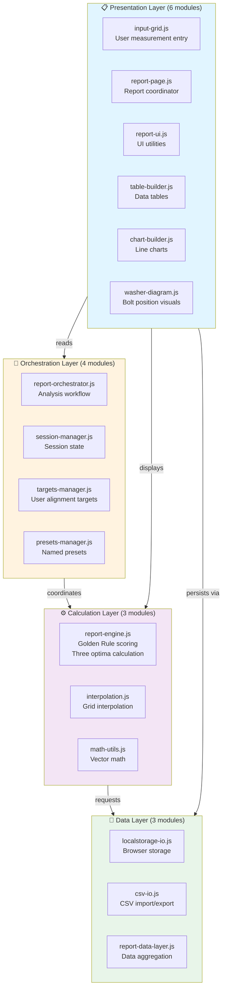

### User Input → Report Analysis Pipeline

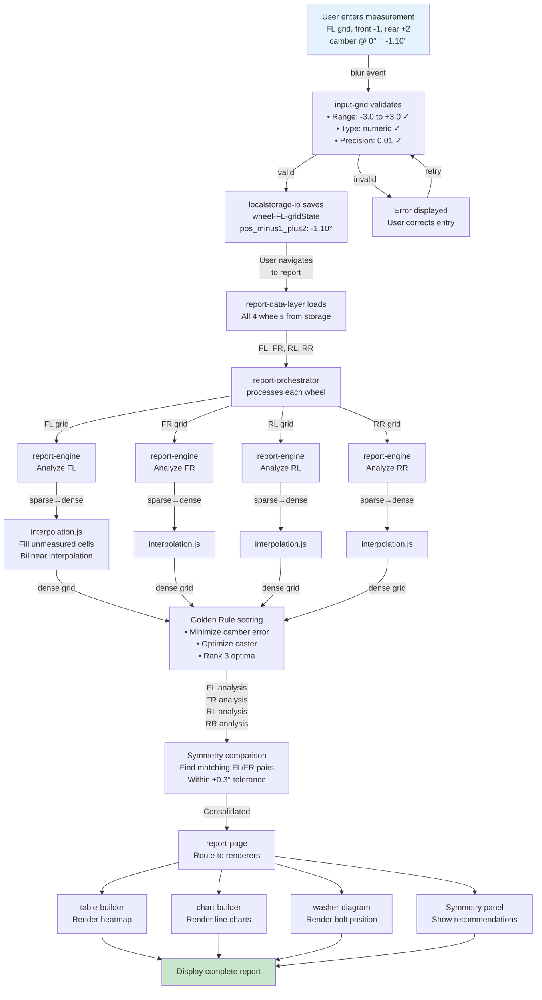

### Three Independent Optima (Analysis Decision Tree)

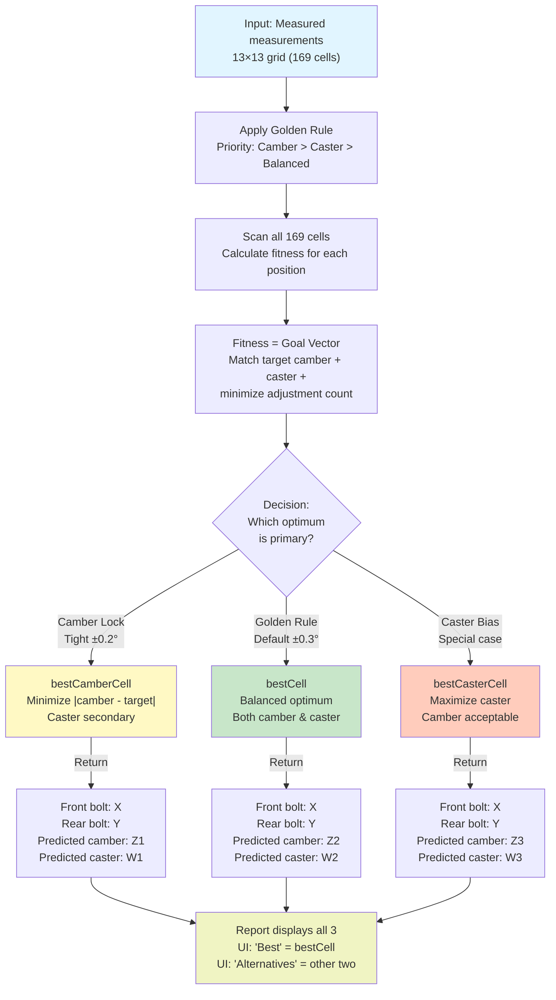

### Module Relationships & Data Flow

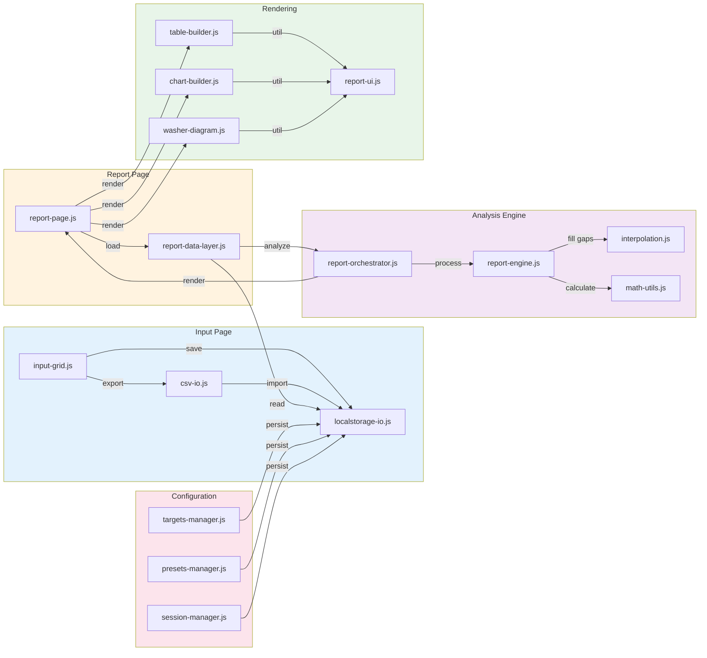

### CSV Import/Export Workflow

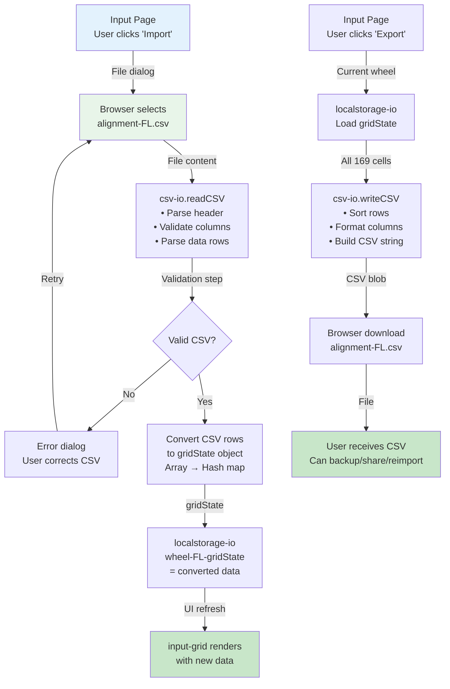

### Interpolation Algorithm (Sparse → Dense Grid)

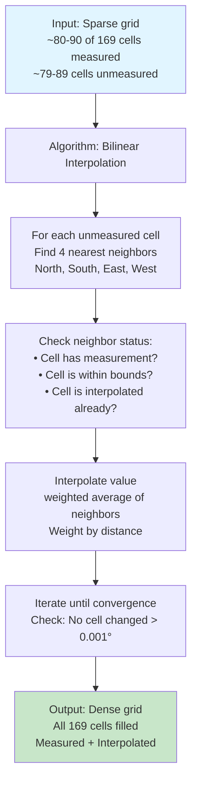

### Error Handling & Recovery Flow

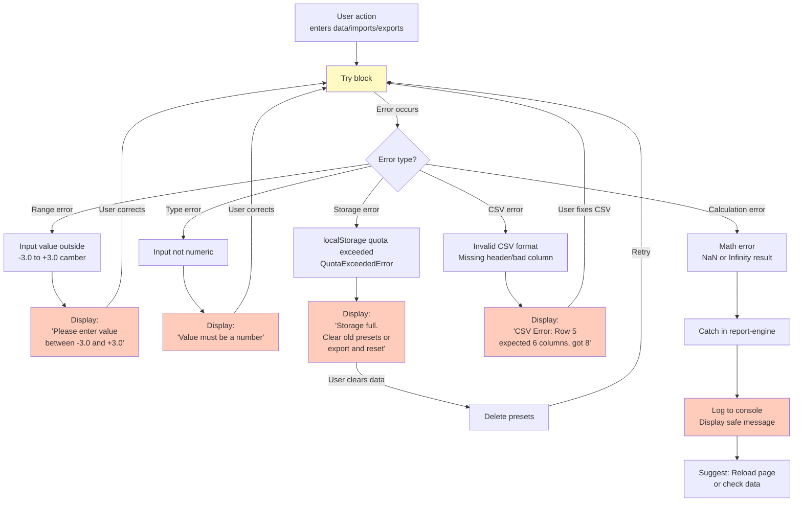

### Performance Profile (Report Generation Timeline)

```mermaid
graph LR
    A["Start: User navigates<br/>to report page"] --> B["Load localStorage<br/>~10ms"]
    
    B --> C["Parse JSON<br/>~5ms"]
    
    C --> D["Analyze FL wheel<br/>• Interpolate<br/>• Score 169 cells<br/>~50ms"]
    
    D --> E["Analyze FR wheel<br/>~50ms"]
    
    E --> F["Analyze RL wheel<br/>~40ms"]
    
    F --> G["Analyze RR wheel<br/>~40ms"]
    
    G --> H["Find symmetry pairs<br/>FL/FR comparison<br/>~20ms"]
    
    H --> I["Format results<br/>~10ms"]
    
    I --> J["Render UI<br/>• Table: ~30ms<br/>• Charts: ~40ms<br/>• Diagrams: ~20ms<br/>~90ms total"]
    
    J --> K["End: Report visible<br/>Total: ~295ms"]
    
    style A fill:#e3f2fd
    style K fill:#c8e6c9
    style B fill:#fff9c4
    style D fill:#f3e5f5
    style E fill:#f3e5f5
    style F fill:#f3e5f5
    style G fill:#f3e5f5
    style J fill:#e8f5e9
```

### Test Coverage Architecture

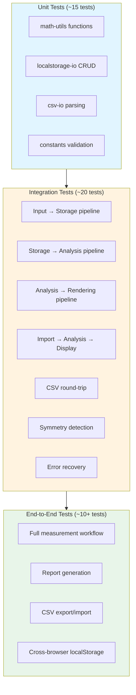

### Rear Wheel Constraint (Camber-Only)

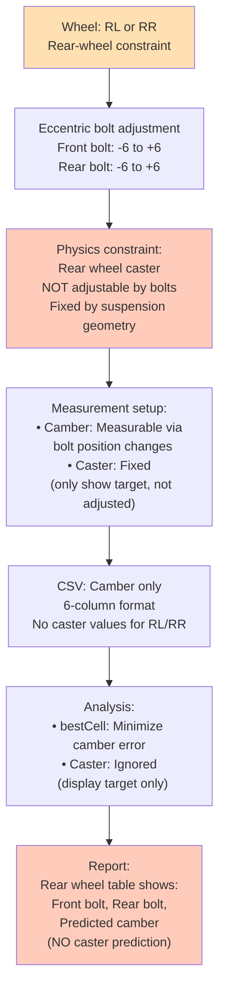

---

## When to Reference These Diagrams

- **Understanding architecture**: System Layers diagram
- **Debugging data flow**: User Input → Report pipeline
- **Analyzing impact of changes**: Module Relationships
- **CSV operations**: Import/Export Workflow
- **Performance issues**: Performance Profile timeline
- **Error scenarios**: Error Handling & Recovery
- **Test coverage**: Test Coverage Architecture
- **Rear wheel special handling**: Rear Wheel Constraint diagram

# Architecture Diagrams & Visual References

**MX-5 NC1 Wheel Alignment System**  
**Last updated**: April 25, 2026

Visual representations of system architecture, module organization, data flow, and dependencies.

---

## System Architecture Layers (4-Tier)

```mermaid
graph TB
    subgraph "UI Layer (6 modules)"
        input-grid["input-grid.js<br/>Measurement Input"]
        report-page["report-page.js<br/>Main HTML"]
        report-ui["report-ui.js<br/>Dashboard"]
        table-builder["table-builder.js<br/>Tables"]
        chart-builder["chart-builder.js<br/>Charts"]
        washer-diagram["washer-diagram.js<br/>Diagrams"]
    end
    
    subgraph "Orchestration Layer (4 modules)"
        report-orchestrator["report-orchestrator<br/>Coordinator"]
        session-manager["session-manager<br/>History"]
        targets-manager["targets-manager<br/>Goals"]
        presets-manager["presets-manager<br/>Configs"]
    end
    
    subgraph "Calculation Layer (3 modules)"
        report-engine["report-engine.js<br/>Analysis"]
        interpolation["interpolation.js<br/>Interpolation"]
        math-utils["math-utils.js<br/>Math"]
    end
    
    subgraph "Data Layer (3 modules)"
        localstorage-io["localstorage-io.js<br/>Browser Storage"]
        csv-io["csv-io.js<br/>Import/Export"]
        report-data-layer["report-data-layer.js<br/>Data Access"]
    end
    
    subgraph "Utilities (5 modules)"
        constants["constants.js<br/>Config"]
        error-handler["error-handler.js<br/>Errors"]
        dummy-data-generator["dummy-data-generator.js<br/>Test Data"]
        generate-dummy["generate-dummy-data.mjs<br/>Generator"]
        server["server.js<br/>Dev Server"]
    end
    
    report-ui --> table-builder
    report-ui --> chart-builder
    report-ui --> washer-diagram
    report-ui --> targets-manager
    report-ui --> error-handler
    
    report-orchestrator --> report-engine
    report-orchestrator --> report-ui
    report-orchestrator --> report-data-layer
    report-orchestrator --> session-manager
    report-orchestrator --> error-handler
    
    report-engine --> interpolation
    report-engine --> math-utils
    report-engine --> constants
    report-engine --> error-handler
    
    interpolation --> math-utils
    interpolation --> constants
    
    table-builder --> math-utils
    table-builder --> constants
    
    chart-builder --> math-utils
    chart-builder --> constants
    
    washer-diagram --> math-utils
    washer-diagram --> constants
    
    targets-manager --> math-utils
    targets-manager --> constants
    targets-manager --> localstorage-io
    
    presets-manager --> localstorage-io
    presets-manager --> constants
    
    session-manager --> localstorage-io
    
    report-data-layer --> localstorage-io
    report-data-layer --> csv-io
    report-data-layer --> error-handler
    
    csv-io --> error-handler
    
    localstorage-io --> error-handler
    
    dummy-data-generator --> constants
    dummy-data-generator --> math-utils
    
    generate-dummy --> dummy-data-generator
    generate-dummy --> csv-io
    
    style input-grid fill:#E3F2FD
    style report-page fill:#E3F2FD
    style report-ui fill:#E3F2FD
    style table-builder fill:#E3F2FD
    style chart-builder fill:#E3F2FD
    style washer-diagram fill:#E3F2FD
    
    style report-orchestrator fill:#FFF3E0
    style session-manager fill:#FFF3E0
    style targets-manager fill:#FFF3E0
    style presets-manager fill:#FFF3E0
    
    style report-engine fill:#F3E5F5
    style interpolation fill:#F3E5F5
    style math-utils fill:#F3E5F5
    
    style localstorage-io fill:#E8F5E9
    style csv-io fill:#E8F5E9
    style report-data-layer fill:#E8F5E9
    
    style constants fill:#FCE4EC
    style error-handler fill:#FCE4EC
    style dummy-data-generator fill:#FCE4EC
    style generate-dummy fill:#FCE4EC
    style server fill:#FCE4EC
```

---

## Data Flow: Input to Report

```mermaid
graph LR
    subgraph "User Action"
        user["👤 User<br/>Enters Measurements"]
    end
    
    subgraph "Input Stage"
        input["input-grid.js<br/>Read grid cells"]
        validate["Validation<br/>Range check"]
    end
    
    subgraph "Storage"
        storage["localStorage<br/>mx5-nc1-alignment-FL"]
    end
    
    subgraph "Report Generation"
        load["Load from<br/>localStorage"]
        interpolate["interpolation.js<br/>Fill sparse grid"]
        analyze["report-engine.js<br/>Calculate 3 optima"]
    end
    
    subgraph "Rendering"
        render["report-ui.js<br/>Create visuals"]
        display["Dashboard<br/>Display results"]
    end
    
    user -->|Click cell, enter value| input
    input --> validate
    validate -->|Valid| storage
    storage -->|User clicks Report| load
    load --> interpolate
    interpolate --> analyze
    analyze -->|{bestCell, best<br/>CamberCell, best<br/>CasterCell}| render
    render --> display
    
    style user fill:#E3F2FD
    style input fill:#E3F2FD
    style validate fill:#FFE0B2
    style storage fill:#E8F5E9
    style load fill:#E8F5E9
    style interpolate fill:#F3E5F5
    style analyze fill:#F3E5F5
    style render fill:#E3F2FD
    style display fill:#E3F2FD
```

---

## Module Dependency Matrix (Compact)

```
Legend: X = depends on, → = depended on by

Module              | Constants | Error-H | Math | LS-IO | CSV | Engine | Interp | Table | Chart | Report-UI | Targets | Session | Data-L
--------------------|-----------|---------|------|-------|-----|--------|--------|-------|-------|-----------|---------|---------|--------
input-grid          |     X     |         |      |   X   |  X  |        |        |       |       |           |         |         |   
report-ui           |     X     |    X    |      |       |     |        |        |   X   |   X   |           |    X    |         |   
table-builder       |     X     |         |  X   |       |     |        |        |       |       |           |         |         |   
chart-builder       |     X     |         |  X   |       |     |        |        |       |       |           |         |         |   
washer-diagram      |     X     |         |  X   |       |     |        |        |       |       |           |         |         |   
localstorage-io     |           |    X    |      |       |     |        |        |       |       |           |         |         |   
csv-io              |           |    X    |      |       |     |        |        |       |       |           |         |         |   
report-data-layer   |           |    X    |      |   X   |  X  |        |        |       |       |           |         |         |   
interpolation       |     X     |         |  X   |       |     |        |        |       |       |           |         |         |   
math-utils          |     X     |         |      |       |     |        |        |       |       |           |         |         |   
report-engine       |     X     |    X    |  X   |       |     |        |   X    |       |       |           |         |         |   
targets-manager     |     X     |         |  X   |   X   |     |        |        |       |       |           |         |         |   
presets-manager     |     X     |         |      |   X   |     |        |        |       |       |           |         |         |   
session-manager     |           |         |      |   X   |     |        |        |       |       |           |         |         |   
error-handler       |     X     |         |      |       |     |        |        |       |       |           |         |         |   
dummy-data-gen      |     X     |         |  X   |       |     |        |        |       |       |           |         |         |   
report-orchestrator |           |    X    |      |       |     |   X    |        |       |       |     X     |         |    X    |   X
```

**Color Key**:
- Blue: UI Layer
- Orange: Orchestration
- Purple: Calculation
- Green: Data
- Red: Utilities

---

## Analysis Pipeline Detail

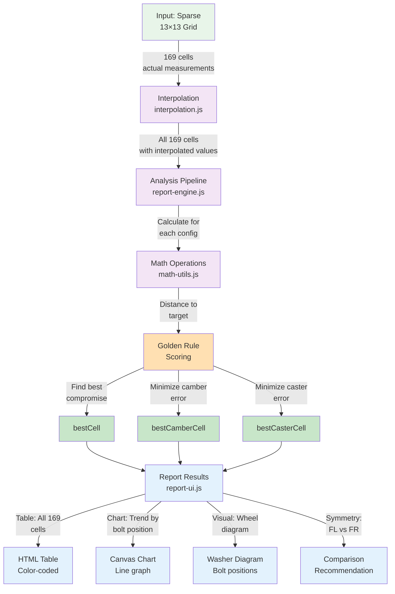

---

## Session Management Lifecycle

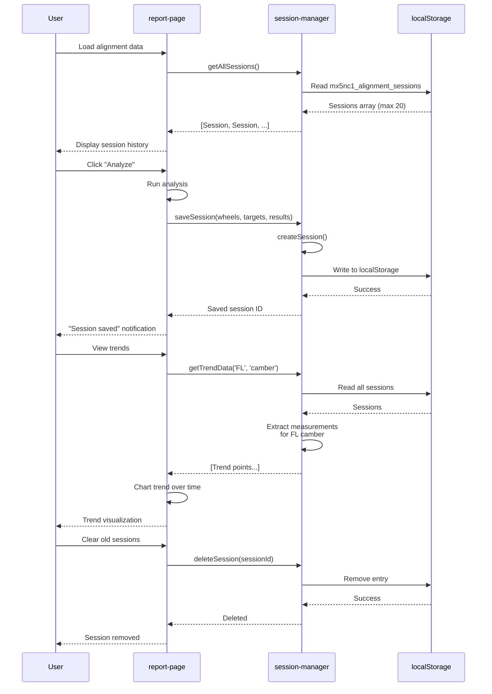

---

## CSV Import/Export Flow

```mermaid
graph LR
    subgraph "Import Path"
        file["CSV File<br/>measurement.csv"]
        parse["csv-io.js<br/>Parse CSV"]
        validate["Validate<br/>Columns & types"]
        store["localStorage<br/>Save"]
        display["input-grid.js<br/>Display"]
    end
    
    subgraph "Export Path"
        load["Load from<br/>localStorage"]
        format["csv-io.js<br/>Format CSV"]
        download["Browser<br/>Download"]
    end
    
    file -->|"Read as text"| parse
    parse -->|"Column mapping"| validate
    validate -->|"Valid"| store
    store -->|"Data available"| display
    display -->|"User sees<br/>imported data"| user["👤 User"]
    
    user -->|"Click Export"| load
    load -->|"Convert to<br/>CSV format"| format
    format -->|"Blob creation"| download
    download -->|".csv file"| user
    
    style file fill:#E8F5E9
    style parse fill:#E8F5E9
    style validate fill:#FFE0B2
    style store fill:#E8F5E9
    style display fill:#E3F2FD
    style load fill:#E8F5E9
    style format fill:#E8F5E9
    style download fill:#E8F5E9
    style user fill:#FCE4EC
```

---

## Error Recovery Paths

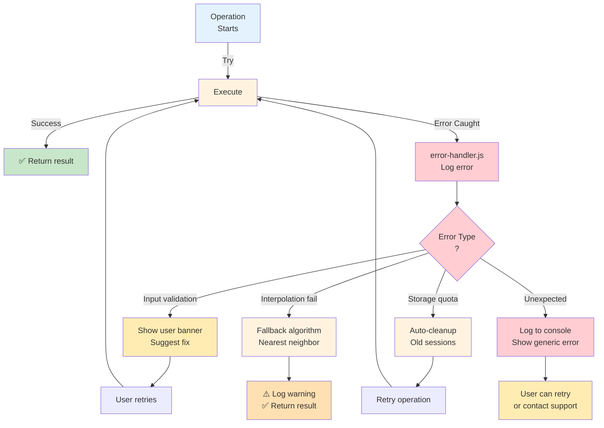

---

## Cross-References

- See [ARCHITECTURE.md](ARCHITECTURE.md) for system overview and design principles
- See [MODULES.md](MODULES.md) for detailed module documentation
- See [INDEX.md](INDEX.md) for module dependency matrix
- See [DEBUGGING.md](DEBUGGING.md) for data transformation tracing with examples
