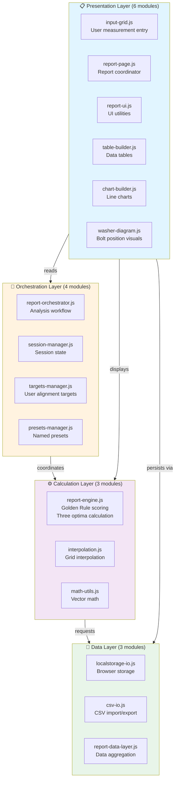
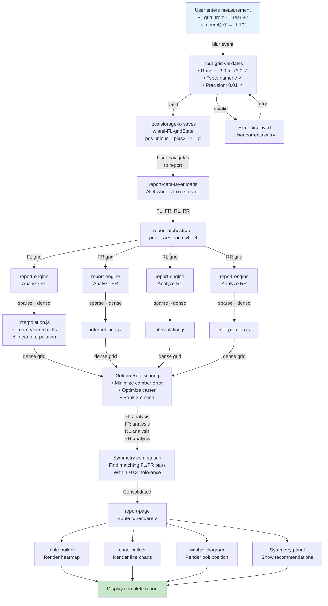

# Architecture — Design Decisions

**Eccentric Bolt Alignment System**  
Last updated: April 26, 2026

---

## System Overview

The alignment system is a **web-based analysis tool** that helps home mechanics optimize wheel alignment by:
1. **Capturing measurements** from physical testing (camber, caster, toe at various bolt positions)
2. **Analyzing trade-offs** using a weighted scoring algorithm
3. **Recommending optimal bolt positions** that balance multiple objectives
4. **Visualizing results** through tables, charts, and eccentric bolt diagrams

**Key constraint**: The system works with **discrete bolt positions** (13×13 grid per wheel). It does **not** calculate continuous adjustments.

---

## 13×13 Grid Structure (Front × Rear Bolt Combinations)

The alignment measurement grid represents **all combinations of two eccentric bolts**:

```
          REAR BOLT POSITIONS (columns)
          ← −6  −5  −4  −3  −2  −1   0  +1  +2  +3  +4  +5  +6 →
    
    −6  [ ]  [ ]  [ ]  [ ]  [ ]  [ ]  [ ]  [ ]  [ ]  [ ]  [ ]  [ ]  [ ]
    −5  [ ]  [ ]  [ ]  [ ]  [ ]  [ ]  [ ]  [ ]  [ ]  [ ]  [ ]  [ ]  [ ]
    −4  [ ]  [ ]  [ ]  [ ]  [ ]  [ ]  [ ]  [ ]  [ ]  [ ]  [ ]  [ ]  [ ]
    ↑   [ ]  [ ]  [ ]  [ ]  [ ]  [ ]  [ ]  [ ]  [ ]  [ ]  [ ]  [ ]  [ ]
    |   [ ]  [ ]  [ ]  [ ]  [ ]  [ ]  [ ]  [ ]  [ ]  [ ]  [ ]  [ ]  [ ]
 F  |   [ ]  [ ]  [ ]  [ ]  [ ]  [ ]  [ ]  [ ]  [ ]  [ ]  [ ]  [ ]  [ ]
 R  0   [ ]  [ ]  [ ]  [ ]  [ ]  [ ]  [ ]  [*]  [ ]  [ ]  [ ]  [ ]  [ ]  ← bestCell (Front 0, Rear 0)
 O  |   [ ]  [ ]  [ ]  [ ]  [ ]  [ ]  [ ]  [ ]  [ ]  [ ]  [ ]  [ ]  [ ]
 N  |   [ ]  [ ]  [ ]  [ ]  [ ]  [ ]  [ ]  [ ]  [ ]  [ ]  [ ]  [ ]  [ ]
 T  ↓   [ ]  [ ]  [ ]  [ ]  [ ]  [ ]  [ ]  [ ]  [ ]  [ ]  [ ]  [ ]  [ ]
    +6  [ ]  [ ]  [ ]  [ ]  [ ]  [ ]  [ ]  [ ]  [ ]  [ ]  [ ]  [ ]  [ ]

B O L T   P O S I T I O N S   ( r o w s )
```

**Key Points**:
- Each cell = one complete configuration (Front bolt position + Rear bolt position)
- 13 positions per axis × 13 = **169 total configurations per wheel**
- When comparing wheels, we compare **entire cells** (configurations), never individual bolt positions
- Each configuration produces two outputs: camber and caster values
- The three optima (bestCell, bestCamber, bestCaster) are three different cells from this grid

**Example**: Cell (Front +1, Rear −2) means: "Adjust front bolt to +1, rear bolt to −2 → produces camber −1.10°, caster 4.99°"

---


```
┌─ INPUT PAGE ─────────────────────────────────┐
│                                               │
│  User enters measurements in grid:           │
│  • Camber readings (−20° sweep, 0°, +20°)   │
│  • At multiple bolt positions (13×13)        │
│                                               │
│  Wheel selection: FL or FR (front only)      │
│  Auto-save to browser localStorage           │
└──────────────────────┬──────────────────────┘
                       │ (localStorage: gridState)
                       ↓
        ┌──────────────────────────────┐
        │  BROWSER localStorage        │
        │  └─ wheel-FL-gridState       │
        │  └─ wheel-FR-gridState       │
        │  └─ alignment-settings       │
        └──────────────────────────────┘
                       │
                       ↓
┌─ REPORT PAGE ────────────────────────────────┐
│                                               │
│  1. Load gridState from localStorage         │
│     └─ Convert to format for calculations    │
│                                               │
│  2. PROCESS WHEEL (report-engine.js)         │
│     └─ Input: 13×13 grid of camber readings │
│     └─ Output: {                             │
│          bestCell, bestCamberCell,           │
│          bestCasterCell,                     │
│          grid, rows, analysis                │
│        }                                      │
│                                               │
│  3. SYMMETRY ANALYSIS (report-engine.js)     │
│     └─ Compare FL vs FR results              │
│     └─ Find symmetric value pairs            │
│     └─ Generate recommendation               │
│     Output: {                                │
│          flRecommendation,  frRecommendation │
│        }                                      │
│                                               │
│  3. RENDER TO UI (report-page.js)            │
│     ├─ Raw Data Table (13×13, color-coded)  │
│     ├─ Camber/Caster Chart (line graph)     │
│     ├─ Washer Diagrams (bolt positions)     │
│     ├─ Symmetry Analysis (L/R comparison)   │
│     └─ Trade-Off Analysis (secondary info)  │
│                                               │
└──────────────────────────────────────────────┘
```

---

## Input Screen Architecture

### Design Principles

The input screen serves a single purpose: **Capture wheel alignment measurements in a 13×13 discrete grid format**.

**Key Constraints**:
1. **Three steering angles only**: Measure camber at +20°, 0°, and −20° steering angles
2. **Position range**: 5–13 measurements per bolt (at least 5, up to all 13 positions from −6 to +6)
3. **LocalStorage as source of truth**: All measurements immediately persisted; no file-based state
4. **Auto-save on every edit**: User never has to manually save
5. **Wheel isolation**: FL and FR sections are independent; no cross-wheel validation
6. **Clear = both UI and localStorage**: Pressing Clear removes all data everywhere

### Data Flow

```
User Input (HTML form)
    ↓ (on each cell edit)
    ├─→ Update UI grid display
    ├─→ Validate input (numeric, range check)
    └─→ Save immediately to localStorage: 
        {
          wheel: 'FL',
          measurements: {
            pos_minus6_minus6: { camber: -1.25, ... },
            ...
          }
        }

User Loads Sample Data
    ↓
    └─→ localStorage cleared
    └─→ New sample gridState loaded to localStorage
    └─→ UI refreshed from localStorage

User Imports CSV
    ↓
    └─→ Parse CSV file
    └─→ Convert to gridState format
    └─→ Write to localStorage (becomes truth)
    └─→ UI refreshes from localStorage

User Presses Clear
    ↓
    ├─→ Clear all form fields (UI)
    ├─→ Remove all localStorage keys:
    │   - localStorage.removeItem('wheel-FL-gridState')
    │   - localStorage.removeItem('wheel-FR-gridState')
    │   - localStorage.removeItem('targets')
    └─→ Blank slate
```

### Sample Data Strategy

Two realistic 13×13 grids (FL and FR) with intentionally different patterns demonstrate that wheels often require different bolt positions. Loaded via `input.html` buttons, they showcase how value symmetry (matching alignment values) differs from bolt symmetry (matching positions).

---

## Report Page Architecture

### Design Principles

The report page transforms raw measurements into recommendations through a **multi-section pipeline**:

```
1. Raw Data         →  See your measurements (heatmap, color coded)
2. Camber/Caster    →  See trends (line charts)
3. Diagrams         →  See bolt positions (visual feedback)
4. Symmetry         →  See recommendations (L/R comparison)
5. Analysis         →  See trade-offs (optional detail)
```

**Key Constraint**: Single page, no section hiding; users scroll or use buttons to switch focus areas.

### Section Navigation Structure

**Left/Right Switching**:
- Buttons to toggle between FL, FR display
- Each section shows either FL or FR, never both simultaneously
- Example: "Symmetry Panel" shows either "FL vs FR comparison" or detailed FL-only view

**Front/Rear Placeholder** (for Phase 2):
- Currently: Only FL/FR available (front wheels)
- Future: Will add RL/RR buttons when four-wheel support added
- Current Phase 1: Front/Rear buttons not visible

**Camber/Caster Highlighting** (within same section):
- Buttons toggle which measurement is highlighted
- Raw Data Table: Both camber and caster visible; buttons change cell color emphasis
- Charts: Both curves drawn; buttons emphasize one line over the other
- Washer Diagrams: Shows position of ONE bolt per button (front or rear)

**Rule**: Switching buttons does NOT change the displayed data, only which aspect is emphasized

### Spatial Layout Rules

**Left/Right Positioning**:
- Left wheel (FL) always displays on left side of screen
- Right wheel (FR) always displays on right side of screen
- If section is split horizontally, left data on left, right data on right

**Front/Rear Positioning** (preparation for Phase 2):
- Front measurements display at TOP of section
- Rear measurements display at BOTTOM of section
- This applies to all section types: tables, charts, diagrams

**Example Layout**:
```
┌─────────────────────────────────────────────┐
│         Symmetry Analysis Section           │
├─────────────────────┬──────────────────────┤
│                     │                       │
│  Camber Caster      │  Camber Caster       │  ← Front row (unused in Phase 1)
│  value  value       │  value  value        │
│                     │                       │
│  FL                 │  FR                  │  ← Labels: Left and Right
│  Front 0            │  Front +1            │
│  Rear -2            │  Rear -1             │
│                     │                       │
├─────────────────────┴──────────────────────┤
│         Recommendation: SYMMETRIC           │
└─────────────────────────────────────────────┘
```

### Button Behavior Rules

**All buttons are in the same container**:
- "Switch to FL" and "Switch to FR" buttons visible simultaneously
- Only one is active (highlighted/pressed state) at a time
- Clicking loads new section content below

**Camber/Caster buttons**:
- Both visible simultaneously
- Only one "active" at a time
- Clicking toggles the emphasis (color, line thickness, etc.)
- **Critical**: Data does NOT change, only display emphasis

```
Example: True Camber/Caster Toggle Behavior
────────────────────────────────────────────
Raw Data Table (13×13 grid):

Before toggle:
┌──────────────┬──────────────┐
│ Camber (emph)│ Caster       │  ← Green/Orange/Red indicates camber quality
│ Cell colors  │ (unfocused)  │
└──────────────┴──────────────┘

After clicking Caster button:
┌──────────────┬──────────────┐
│ Camber       │ Caster (emph)│  ← Green/Orange/Red now indicates caster quality
│ (unfocused)  │ Cell colors  │
└──────────────┴──────────────┘

But the actual values shown remain identical; only visual emphasis changes
```

---

## Module Responsibilities

### **Data Layer** (Persistence & Format)

| Module | Responsibility |
|--------|---|
| `constants.js` | Configuration: targets, thresholds, bolt positions, physical constants |
| `localstorage-io.js` | Read/write localStorage; serialize/deserialize gridState |
| `csv-io.js` | CSV import/export; file I/O operations |

### **Processing Layer** (Analysis & Calculations)

| Module | Responsibility |
|--------|---|
| `report-engine.js` | Core analysis: scoring, grid interpolation, symmetry analysis |
| `interpolation.js` | Fill gaps in measurement grid using polynomial interpolation |
| `targets-manager.js` | Calculate target values and acceptable error ranges |

### **Presentation Layer** (UI & Rendering)

| Module | Responsibility |
|--------|---|
| `input-grid.js` | Input sheet: grid rendering, cell editing, auto-save |
| `report-page.js` | Report: load data, orchestrate rendering, handle events |
| `chart-builder.js` | Chart.js wrapper: generate camber/caster line charts |
| `washer-diagram.js` | SVG rendering: eccentric bolt position diagrams |

### **Utilities**

| Module | Responsibility |
|--------|---|
| `server.js` | Development web server (Node.js) |
| `generate-dummy-data.mjs` | Generate sample alignment data for testing |

---

## Related Documentation

See **internals.md** for algorithm deep-dives and **guide.md** for development tasks and troubleshooting.

---

## Key Algorithms

### ⚠️ Important: Algorithm Not Meant to Be Edited

The symmetry analysis algorithm is **designed to be stable and not modified**. It uses a simple, straightforward approach:

1. **Search all possible pairs** (169 FL configurations × 169 FR configurations = 28,561 comparisons)
2. **Find closest match** where camber and caster differ by ≤±0.3° on both wheels
3. **Return best compromise** (the pair with lowest combined error)

**Why this design**:
- Transparent and auditable (easy to verify results)
- No complex weighting or tuning required
- Users understand exactly why a position was recommended
- Simple logic = fewer bugs = more maintainable

**Do NOT modify because**:
- Weighting factors would add confusion (users wouldn't understand "why" recommendations changed)
- The ±0.3° tolerance is the key parameter; change that, not algorithm weights
- More complex algorithms are harder to debug when users report surprising results

If you disagree with a recommendation, **adjust the ±0.3° tolerance**, not the algorithm itself.

---

### **Algorithm 1: Process Wheel → Find Best Position per Wheel**

**Input**: 13×13 grid of camber readings at different bolt positions

**Steps**:
1. Interpolate grid to fill any gaps
2. For each grid position, calculate how far it is from target:
   - Camber error: |reading − TARGET_CAMBER|
   - Caster error: |reading − TARGET_CASTER|
3. Find the position with the best combination of errors:
   - Prioritize getting camber right (tire wear matters most)
   - Then get caster as close as possible
   - No weighting formula; just the closest match

**Output**: `{ bestPosition, camber, caster, camberError, casterError }`

**See**: [report-engine.js `processWheel()`](../js/report-engine.js)

### **Algorithm 2: Symmetry Analysis → Compare Complete Configurations L/R**

**Input**: FL and FR processed results (each with best position, camber, caster values)

**Key Principle**: 
- Each position in the 13×13 grid represents a complete configuration: **Front bolt position + Rear bolt position**
- We compare FL's complete configurations vs FR's complete configurations
- We do NOT compare front bolts independently or rear bolts independently
- See [DESIGN.md § Eccentric Bolt Coupling](DESIGN.md) for physical rationale

**Steps**:
1. Search for **symmetric pairs** with ±0.3° tolerance:
   - Try all combinations of FL configurations (169) × FR configurations (169)
   - For each pair, check: |FL camber − FR camber| ≤ 0.3° AND |FL caster − FR caster| ≤ 0.3°?
   - Calculate combined error: (|camberDelta| + |casterDelta|) / 2
   - Find the pair with lowest error

2. Return the best available pair:
   - If a perfect match exists within tolerance: return it (true symmetry)
   - If no perfect match: return the closest approximation (best compromise)

**Output**: `{ flRecommendation, frRecommendation, matchType }`
- `flRecommendation`: Front position, Rear position, resulting camber, resulting caster for FL wheel
- `frRecommendation`: Same for FR wheel
- `matchType`: "symmetric" if values match within ±0.3°, or "asymmetric" if this is the best compromise

**See**: [report-engine.js `symmetryAnalysis()`](../js/report-engine.js)

**Why This Matters**:
The grid search (13×13 = 169 positions per wheel) explores all possible combinations of front/rear bolts. Each cell represents one complete configuration. The search naturally respects the physical coupling of the two eccentric bolts and ensures both are optimized together, not matched independently.

### **Algorithm 3: Interpolation → Fill Grid Gaps**

**Problem**: Not all 169 positions measured; grid has sparse data

**Solution**: Polynomial interpolation across rows/columns

**See**: [interpolation.js](../js/interpolation.js)

---

## Known Limitations & Future Expansion

### Phase 1 (Current: Front Wheels Only)
- Two wheels (FL, FR) analyzed
- Camber + Caster only (Toe integration outstanding)
- Front-only eccentric bolt adjustment

### Phase 2 (Planned: Four Wheels)
- Add RL, RR wheels
- Modify data structure to support 4 wheels
- Consider front-rear thrust angle alignment
- Rear wheels may have different adjustment mechanisms
- Scoring may need rear-specific targets

### Phase 3 (Future Ideas, Not Committed)
- Compare multiple preset strategy sets
- Export configuration to 3D visualization
- Mobile app with camera-based measurements
- Integration with alignment shop tools

---

## Visual Architecture Diagrams

This section provides visual diagrams of the system architecture, data flows, module relationships, and analysis pipelines using Mermaid.

### System Layers (4-Tier Architecture)



### User Input → Report Analysis Pipeline



---

## Related Documentation

See **internals.md** for algorithm deep-dives and **guide.md** for development tasks and troubleshooting.

---

## When to Reference These Diagrams

- **Understanding architecture**: System Layers diagram
- **Debugging data flow**: User Input → Report pipeline
- **Analyzing impact of changes**: Module Relationships
- **CSV operations**: Import/Export Workflow
- **Performance issues**: Performance Profile timeline
- **Error scenarios**: Error Handling & Recovery
- **Test coverage**: Test Coverage Architecture
- **Rear wheel special handling**: Rear Wheel Constraint diagram

---

## Related Documentation

For deeper technical details, see:
- **internals.md** — Algorithm deep-dives, interpolation math, error handling, debugging
- **guide.md** — User workflow, development tasks, troubleshooting
